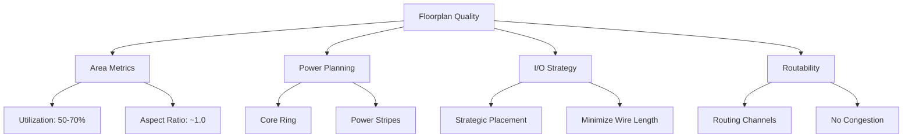

# Day 2 - Floorplanning Implementation

Detailed analysis of floorplan quality, standard cell library architecture, and strategic die/core area definition.

## 📑 Table of Contents

1.  [Core Concepts in Floorplanning](https://www.google.com/search?q=%231-floorplan-fundamentals)
2.  [Floorplan Configuration and Execution Methodology](https://www.google.com/search?q=%232-floorplan-configuration--execution)
3.  [Analysis and Visualization of Floorplan Results](https://www.google.com/search?q=%233-analyzing-and-visualizing-floorplan-results)

-----

## 🎯 Introduction to Day 2 Objectives

Following the successful completion of synthesis and generation of the gate-level netlist, today's focus shifts to the critical **Floorplanning** stage. This process establishes the physical layout and organization of the chip's logical components. It is analogous to an architect defining a building's blueprint before construction, mapping out functional areas. 🏗️

A well-executed floorplan is fundamental to design closure, as it directly impacts timing performance (PPA), power distribution integrity, and overall routability and functionality of the final integrated circuit.

-----

## 1\. Core Concepts in Floorplanning

### 🗺️ Defining Floorplanning

Floorplanning constitutes the initial and foundational stage of physical design, encompassing several key tasks:

  - 📐 Defining the chip's physical boundaries, including the total die area and the usable core area.
  - ⚡ Architecting the Power Distribution Network (PDN), including power rings and stripes.
  - 📍 Strategically placing I/O (Input/Output) pins/pads based on system-level connectivity.
  - 🎯 Allocating and placing hard macros (e.g., memory blocks) and defining regions for standard cell placement.

> 💡 **Analogy:** In integrated circuit design, floorplanning serves the same role as urban planning in civil engineering. It involves the strategic layout of power grids, communication (routing) channels, and functional blocks *before* the detailed implementation (placement) commences.

### 🎯 Key Metrics for Floorplan Quality Assessment



**Fundamental Formulas:**

```
Core Utilization (%) = (Total Area of Standard Cells + Macros / Total Core Area) × 100%

Aspect Ratio = Core Height / Core Width

Optimal Floorplan Target = {Utilization: 50-70%, Aspect Ratio: 0.8-1.2, Minimal congestion}
```

-----

### ✅ Comparative Analysis: Effective vs. Ineffective Floorplans

| Aspect | ✅ Effective Floorplan | ❌ Ineffective Floorplan |
|--------|------------------|------------------|
| **📏 Utilization** | 50-70% (Ample routing resources) | \>80% (High congestion, insufficient routing space) |
| **📐 Aspect Ratio** | 0.8-1.2 (Balanced, squarish core) | \>2.0 or \<0.5 (Extreme, causes timing skew) |
| **🔌 I/O Placement** | Optimized based on connectivity | Haphazard, causes wire length/routing issues |
| **⚡ Power Grid** | Robust core ring + dense stripes (\~150µm pitch) | Sparse grid, high pitch (leads to IR drop) |
| **🎯 Macro Placement** | Connectivity-driven, avoids channel blockage | Obstructs standard cell areas and routing channels |
| **🛣️ Routing Channels** | Clearly defined and sufficient spacing | Congestion hotspots, insufficient channels |
| **📦 Core Margin** | 2-5µm (space for PDN ring) | 0µm (Cells abut die edge, PDN issues) |

### ⚠️ Critical Floorplan Warning Indicators

```
🚨 CRITICAL ISSUES:
   ├── Utilization > 85% → Indicates severe routing congestion.
   ├── Aspect Ratio > 2.0 → Leads to unachievable timing closure.
   ├── Overlapping macros → Results in a physical DRC violation.
   ├── IR drop > 10% → Signifies power integrity and reliability failure.
   └── Congestion > 80% → Predicts a non-routable design.
```

-----

## 2\. Floorplan Configuration and Execution Methodology

### 🎛️ Essential Floorplan Configuration Parameters

#### Core Configuration Parameters

| Switch | Purpose | Typical Value | Consequence of Misconfiguration |
|--------|---------|---------------|-----------------|
| **🔲 `FP_CORE_UTIL`** | Target core utilization percentage | **50-60%** | High: Routability failure<br>Low: Wasted silicon area |
| **🟪 `FP_ASPECT_RATIO`** | Core Height-to-Width ratio | **1.0 (square)** | Extreme values introduce timing skew |
| **⚖️ `FP_SIZING`** | Sizing mode for die/core | `"relative"` | `absolute` may conflict with utilization |
| **📐 `DIE_AREA`** | Absolute die boundary coordinates | `"0 0 1000 1000"` | Used only with absolute sizing mode |


#### I/O Configuration

| Switch | Purpose | Typical Value | Consequence of Misconfiguration |
|--------|---------|---------------|-----------------|
| **🔌 `FP_IO_MODE`** | I/O pin placement algorithm | `0` = matching<br>`1` = random | Sub-optimal timing; pin access issues |
| **🧭 `FP_IO_HMETAL`** | Metal layer for horizontal I/O pins | **4** (Metal4) | DRC violations, routing conflicts |
| **🧭 `FP_IO_VMETAL`** | Metal layer for vertical I/O pins | **3** (Metal3) | Layer mismatch, routing failure |
| **🧱 `FP_CORE_MARGIN`** | Spacing from core to die edge | **2-5 µm** | Insufficient space for power rings |

#### Power Planning

| Switch | Purpose | Typical Value | Consequence of Misconfiguration |
|--------|---------|---------------|-----------------|
| **🔋 `FP_PDN_CORE_RING`** | Toggles creation of a core power ring | `1` = Enable | Significant IR drop if disabled |
| **♻️ `FP_PDN_AUTO_ADJUST`** | Automatically adjust PDN parameters | `1` = Enable | Requires manual PDN tuning |
| **📏 `FP_PDN_VPITCH`** | Spacing between vertical power stripes | **≈150 µm** | Poor pitch causes IR drop or blockage |
| **📏 `FP_PDN_HPITCH`** | Spacing between horizontal power stripes | **≈150 µm** | Poor pitch causes IR drop or blockage |
| **⚡ `VDD_NETS`** | Logical name(s) for power net | `"vccd1"` or `"VDD"` | Power grid is not connected |
| **⚡ `GND_NETS`** | Logical name(s) for ground net | `"vssd1"` or `"GND"` | Ground grid is not connected |

#### Advanced Configuration

| Switch | Purpose | Typical Value | Consequence of Misconfiguration |
|--------|---------|---------------|-----------------|
| **⚙️ `FP_TAPCELL_DIST`** | Spacing between tap (well tap) cells | **14 µm** | Increased risk of latch-up |
| **🧠 `DESIGN_IS_CORE`** | Defines design as top-level or block | `1` = Core | Incorrect PDN or I/O structure |

-----

### 📊 Detailed Configuration Guidelines

**Utilization Strategy Analysis:**

```
├── 40-50% → Low density: Eases routing, suitable for test chips or analog.
├── 50-60% → Balanced: RECOMMENDED starting point for most digital designs.
├── 60-70% → High density: Requires careful placement and routing strategy.
├── 70-80% → Very high density: Expert intervention required; high congestion risk.
└── >80%  → Extreme density: High probability of routing failure.
```

**Aspect Ratio Impact Analysis:**

```
├── 0.5 → Wide rectangle (2:1) → Biases routing towards horizontal layers.
├── 1.0 → Square ✅ → Balanced horizontal/vertical routing paths.
├── 2.0 → Tall rectangle (1:2) → Biases routing towards vertical layers.
└── > 2.5 → Extreme shape → Introduces severe timing skew between corners.
```

-----

### 🚀 Executing the Floorplan Stage in OpenLANE

Execute the floorplan stage:

```tcl
% run_floorplan
```


**Process Breakdown:**

  - ✅ The OpenLANE flow manager executes the sequence of floorplanning steps.
  - 📊 This includes I/O placement, tap cell insertion, and PDN generation.
  - ⚡ Die and core dimensions are calculated based on the specified configuration.
  - 🎯 Standard cell placement rows are defined and created.
  - ⏱️ Execution time for each sub-task is logged.

**Indicators of Successful Execution:**

  - The process log file reports zero errors or critical warnings.
  - Die area is calculated and reported as expected.
  - I/O pin placement completes without violations.
  - Tap cells are successfully inserted and aligned.

-----

## 3\. Analysis and Visualization of Floorplan Results

### 📊 Analyzing Floorplan Results

#### Default Configuration File Reference

**Location:** `$OPENLANE_ROOT/configuration/floorplan.tcl`


**File Contents:**

  - 📋 Default values for all floorplan-related configuration variables.
  - 🔧 Default settings for core utilization and aspect ratio.
  - ⚡ Default PDN generation parameters.
  - 🔌 Default I/O placement settings.
  - 🎯 These serve as fallback values if not specified in the design's `config.tcl`.

-----

#### I/O Placer Log Analysis

**Location:** `logs/floorplan/4-io.log`


**Information Provided:**

  - 🔌 Details of the I/O pin placement algorithm executed.
  - 📍 Information on pin distribution and spacing.
  - ⚙️ The specific I/O placement mode utilized.
  - 🧭 Metal layers assigned for horizontal and vertical pins.
  - ✅ Confirmation of successful placement without conflicts.

**Verification Checklist:**

  - All expected I/O pins are successfully placed.
  - Absence of any pin placement violations or overlaps.
  - Verification of correct metal layer assignments (e.g., M3/M4).
  - Confirmation of adequate spacing between pins.

-----

#### DEF (Design Exchange Format) File Analysis

**Location:** `results/floorplan/picorv32a.def`


**Key Information:**

| Element | Description | Format |
|---------|-------------|--------|
| **DIEAREA** | Defines the die's lower-left and upper-right coordinates | `(llx lly) (urx ury)` |
| **UNITS** | Database unit precision | `DISTANCE MICRONS 1000` |
| **COMPONENTS** | Count of placed instances (macros, cells) | Total number of components |
| **PINS** | I/O pin definitions and locations | Total number with coordinates/layers |
| **ROWS** | Standard cell row definitions | Origin, orientation, pitch, count |

**Verification Checklist:**

  - The DIEAREA dimensions align with the configuration.
  - The core area is correctly offset from the die area (core margin).
  - All PINS are present and possess valid coordinates and layer assignments.
  - ROW definitions (site, orientation, spacing) are correct for the technology.

-----

### 📈 Key Metric Extraction and Calculation

```
📊 Floorplan Quality Metrics:
   ├── 📐 Die Area (µm²) = Die Width × Die Height
   ├── 📦 Core Area (µm²) = Core Width × Core Height
   ├── 🎯 Utilization (%) = (Total Cell Area / Core Area) × 100
   ├── 📏 Aspect Ratio = Core Height / Core Width
   ├── 🔌 Total I/O Pin Count
   ├── ⚡ PDN Stripe Pitch (µm)
   └── 🧱 Core to Die Margin (µm)
```

**Example Calculation from DEF (using 1000 DBU/µm):**

```python
# Assuming UNITS DISTANCE MICRONS 1000
DIE_WIDTH_UM = (DIEAREA_urx - DIEAREA_llx) / 1000
DIE_HEIGHT_UM = (DIEAREA_ury - DIEAREA_lly) / 1000
DIE_AREA_UM2 = DIE_WIDTH_UM * DIE_HEIGHT_UM

# Core area must be derived from row definitions or core boundary
ASPECT_RATIO = CORE_HEIGHT_UM / CORE_WIDTH_UM
UTILIZATION_PCT = (TOTAL_STD_CELL_AREA / CORE_AREA_UM2) * 100
```

-----

### 🎨 Visualizing the Floorplan using MAGIC

#### Loading the Floorplan into MAGIC

Navigate to the floorplan results directory and launch MAGIC:

```bash
cd designs/picorv32a/runs/results/floorplan/

magic -T /home/vboxuser/vboxuser/OpenLane/venv/lib/python3.10/site-packages/ciel/build/sky130A/libs.tech/magic/sky130A.tech 
lef read ../../tmp/merged.nom.lef  
def read picorv32.def &

```

-----

#### Full Chip View Analysis


**Key Visual Elements:**

| Color/Element | Represents | Significance |
|---------------|-----------|--------------|
| 🟦 **Blue/Purple** | Standard cell rows (placement sites) | Defines legal locations for cell placement |
| 🟥 **Red lines** | Metal layers (PDN/Routing) | Power grid structure and routing resources |
| 🟨 **Yellow rectangles** | I/O Pins / Pads | Interface points at the chip periphery |
| ⚪ **White space** | Routing channels / Core margin | Essential for routability and power ring |
| 🎯 **Grid pattern** | Placement site grid (via `G`) | Smallest unit of cell placement |
| **Black outline** | Die Area Boundary | The physical edge of the silicon |

**Navigation Controls:**

  - **Center Design:** Press `S` (Select All) followed by `V` (View All).
  - **Zoom to Area:** Left-click and drag to define a box, then press `Z`.
  - **Zoom Out:** Press `Shift + Z`.
  - **Full View:** Press `V`.

-----

#### Essential MAGIC Tool Commands

**Basic Navigation:**

| Command | Action | Usage |
|---------|--------|-------|
| **`S`** | Select | Point cursor and press `S` |
| **`V`** | View All | Resets view to show entire design |
| **`Z`** | Zoom In | Select area with mouse, then press `Z` |
| **`Shift+Z`** | Zoom Out | Zooms out by one factor |
| **`U`** | Undo | Reverts the last action |

**Inspection Commands:**

| Command | Action | Result |
|---------|--------|--------|
| **`what`** | Query selection | Prints cell/layer info to `tkcon` window |
| **`:box`** | Show dimensions | Prints coordinates and dimensions |
| **`I`** | Select Instance | Selects the entire cell instance |
| **`B`** | Bounding Box | Displays the bounding box of the selection |
| **`X`** | Expand Cell | Expands the selected cell hierarchy |

**Display Commands:**

| Command | Purpose |
|---------|---------|
| **`?`** | Display help menu |
| **`G`** | Toggle placement grid display |
| **`;`** | Open `tkcon` command line |

-----

#### Detailed Cell Inspection (`what` command)


**Procedure:**

1.  Zoom into a specific region of interest (e.g., a tap cell).
2.  Hover the cursor over the desired cell.
3.  Press `S` to select the object under the cursor.
4.  Type `what` in the `tkcon` command window.
5.  The tool will output detailed information.

**Output Information:**

  - The name of the cell instance (e.g., decap, tap, filler).
  - Specific layer information (e.g., Metal1, Poly).
  - The cell's bounding box coordinates and dimensions.
  - Internal pin locations and names.

**Verification Checks:**

  - ✅ Verify that cells are correctly aligned to the placement grid.
  - ✅ Ensure no cells are overlapping.
  - ✅ Confirm the correct cell type (e.g., `sky130_fd_sc_hd__tapvpwrgnd_1`).
  - ✅ Check for correct layer usage and connectivity.

-----

### 🔍 Critical Area Inspection Checklist

```
🔍 Inspection Checklist:
   ├── 🔌 I/O Pins → Verify location, metal layer, and spacing.
   ├── 🎯 Core Boundary → Confirm margin from die edge, ensure row integrity.
   ├── ⚡ Power/Ground Rings → Check width, layers, and continuity.
   ├── 🧱 Tap Cells → Verify correct insertion, spacing (e.g., ~14µm), and row placement.
   ├── 📍 Macros (if any) → Check position, orientation, and routing blockages.
   └── 🟦 Standard Cell Rows → Validate height, spacing, and continuity across the core.
```

-----

### ✅ Final Quality Assurance Checks

**Dimensional Verification:**

  - Die dimensions conform to specifications.
  - Core utilization is within the target range (e.g., 50-70%).
  - Aspect ratio is balanced (e.g., \~1.0).

**I/O Verification:**

  - All I/O pins are successfully placed without conflicts.
  - Pin locations are logical relative to data flow.
  - No obvious I/O-related congestion points.
  - Correct metal layers are utilized for pins.

**Power Planning Verification:**

  - The core power ring is present (if enabled) and continuous.
  - Power stripe pitch and width are adequate for the design.
  - VDD/GND nets are correctly defined and connected.
  - No apparent PDN-related DRC violations.

**Placement Readiness:**

  - Standard cell rows are correctly defined, spaced, and oriented.
  - Sufficient routing channels exist between rows and macros.
  - No blockages (e.g., macros) overlap placement areas.
  - Tap cells are inserted correctly within the rows.

-----

### ⚠️ Common Issues and Debugging Strategies

| Issue | Symptom in Layout/Log | Resolution Strategy |
|-------|---------|-----|
| **Excessive Utilization** | Utilization \> 80%; high congestion map | Increase die size or reduce `FP_CORE_UTIL` variable |
| **Insufficient Core Margin** | Standard cell rows touch die edge | Set `FP_CORE_MARGIN` to a non-zero value (e.g., 2-5µm) |
| **I/O Pin Conflicts** | Pins overlap or are placed illogically | Adjust `FP_IO_MODE` or manually edit pin placement |
| **Missing Power Ring** | No PDN ring visible in MAGIC | Ensure `FP_PDN_CORE_RING` is enabled (`1`) |
| **Extreme Aspect Ratio** | Core is extremely tall or wide | Adjust `FP_ASPECT_RATIO` closer to 1.0 |

-----

## 💡 Summary of Key Concepts

  - 🎯 An optimal floorplan balances utilization (50-70%), aspect ratio (\~1.0), and routability.
  - 📐 Configuration variables are critical for defining core utilization, I/O placement, and power planning.
  - 🔍 Verification involves analyzing DEF files, reviewing logs, and conducting visual inspection in MAGIC.
  - ⚡ A robust power plan, including core rings and appropriate stripe spacing, is non-negotiable.
  - ✅ Thorough verification at this stage prevents significant downstream issues in placement and routing.

-----

*"A well-architected floorplan is analogous to a building's foundation—it is unseen in the final product, yet its integrity determines the success of the entire structure."* 🏗️
