# 🏭 Day 3 — Standard Cells: Silicon → Synthesis

Deep dive into standard cell design, fabrication-to-GDS view, and synthesis mapping.


## 🚀 IC Design Flow: From Blueprint to Chip

```mermaid
graph TD
    %% 1. The Foundation (PDK)
    A("📐 PDK: The Design Blueprint")
    
    %% 2. Creation (Cell Design)
    B{"✨ Custom Cell Creation"}
    
    %% 3. Artistry (Layout)
    C["🎨 Layout: The Silicon Tapestry"]
    
    %% 4. Validation (Characterization)
    D("🔬 Post-Layout Characterization")
    
    %% 5. Output Data (Library Files)
    E("📈 .lib Files: The Performance Catalog")
    
    %% 6. Automation (Synthesis)
    F[💻 Logic & Synthesis Engine]
    
    %% 7. The Final Product
    G(((💎 Your Final Chip!)))

    %% Connections and Descriptions
    A -- provides foundational rules --> B
    B -- transforms into geometric art --> C
    C -- ensures perfection with tests --> D
    D -- generates essential performance data --> E
    E -- feeds crucial info to --> F
    F -- magically translates design into --> G
    
    %% Professional Styling for README
    style A fill:#e0f7fa, stroke:#00BCD4, stroke-width:2px, color:#000000
    style B fill:#ffe0b2, stroke:#FF9800, stroke-width:2px, color:#000000
    style C fill:#c8e6c9, stroke:#4CAF50, stroke-width:2px, color:#000000
    style D fill:#f8bbd0, stroke:#E91E63, stroke-width:2px, color:#000000
    style E fill:#e1bee7, stroke:#9C27B0, stroke-width:2px, color:#000000
    style F fill:#bbdefb, stroke:#2196F3, stroke-width:2px, color:#000000
    style G fill:#fffde7, stroke:#FFEB3B, stroke-width:3px, color:#000000

```



Think of library cells as **pre-built LEGO blocks** for chips. Instead of designing every transistor, you snap together tested, characterized cells!

---

## 🧩 What's in a Standard Cell Library?


### 🔋 Drive Strength Variants - Choose Your Power!

| Cell | Drive | Width | Best For | Example |
|------|-------|-------|----------|---------|
| **X1** | 1x | W | 🐭 Short wire, 1-2 fanout | Local connections |
| **X2** | 2x | 2W | 🐇 Medium wire, 3-5 fanout | Standard logic |
| **X4** | 4x | 4W | 🐎 Long wire, 6-10 fanout | Critical paths |
| **X8** | 8x | 8W | 🦁 Very long wire, high fanout | Clock buffers |

> 💡 **Note :** Bigger drive = More speed + More area + More power

---

## 🏗️ The Cell Design Journey

```mermaid
flowchart TD
    Start([🎬 Start: Need a NAND2 Gate]) --> Input[📥 Gather Inputs]
    
    Input --> PDK[📐 PDK: Rules & Models]
    Input --> DRC[✅ DRC Rules]
    Input --> LVS[🔍 LVS Rules]
    Input --> SPICE[⚡ SPICE Models]
    
    PDK --> Circuit[🧠 1. Circuit Design]
    DRC --> Circuit
    LVS --> Circuit
    SPICE --> Circuit
    
    Circuit --> |Define Logic| Schematic[Draw Schematic]
    Schematic --> |Size Transistors| Simulate[SPICE Simulation]
    Simulate --> |Verify Function| CircuitDone[✅ Circuit Complete]
    
    CircuitDone --> Layout[🎨 2. Layout Design]
    Layout --> Draw[Draw Physical Shapes]
    Draw --> Metal[Add Metal Layers]
    Metal --> Verify[DRC + LVS Check]
    Verify --> |Pass?| LayoutDone[✅ Layout Complete]
    
    LayoutDone --> Char[🔬 3. Characterization]
    Char --> Extract[Extract Parasitics]
    Extract --> Sweep[Run PVT Simulations]
    Sweep --> Tables[Generate Timing Tables]
    Tables --> Output[📤 Output Files]
    
    Output --> LEF[📐 LEF: Physical info]
    Output --> LIB[📊 .lib: Timing data]
    Output --> GDS[💾 GDS: Full layout]
    
    LEF --> Done([🎉 Ready for Synthesis!])
    LIB --> Done
    GDS --> Done
    
    style Start fill:#4caf50
    style Done fill:#4caf50
    style Circuit fill:#2196f3
    style Layout fill:#ff9800
    style Char fill:#9c27b0
    style Output fill:#f44336
```



---

## 🧠 Phase 1: Circuit Design

### Example: 2-Input NAND Gate

```
Truth Table:          Circuit:
A  B │ Y                VDD
─────┼───               │
0  0 │ 1          ┌─────┴─────┐
0  1 │ 1          │           │
1  0 │ 1        [PMOS_A]   [PMOS_B]  ← Parallel (pull-up)
1  1 │ 0          │           │
                   └─────┬─────┘
                         Y
                         │
                   ┌─────┴─────┐
                   │           │
                 [NMOS_A]   [NMOS_B]  ← Series (pull-down)
                   │           │
                   └─────┬─────┘
                         │
                        GND
```

**Key Sizing Rules:**
- PMOS width = 2× NMOS (compensate lower mobility)
- Series NMOS = 2× wider (reduce resistance)
- Balance rise/fall times for symmetry

---

## 🎨 Phase 2: Layout Design

### The Layer Stack

```mermaid
graph TB
    subgraph Layout Layers
    M3[🟪 Metal 3: Long Routes]
    V2[⚪ Via 2]
    M2[🟧 Metal 2: Power Rails VDD/GND]
    V1[⚪ Via 1]
    M1[🟨 Metal 1: Local Connections]
    CNT[⚫ Contacts]
    POLY[🟥 Polysilicon: Gates]
    DIFF[🟩 Diffusion: Source/Drain]
    NWELL[🟦 N-Well: PMOS Region]
    SUB[⬛ P-Substrate]
    end
    
    M3 --> V2 --> M2 --> V1 --> M1 --> CNT --> POLY
    CNT --> DIFF --> NWELL --> SUB
    
    style M3 fill:#ba68c8
    style M2 fill:#ff9800
    style M1 fill:#ffeb3b
    style POLY fill:#f44336
    style DIFF fill:#4caf50
    style NWELL fill:#2196f3
```



### Layout Checklist
✅ Follow ALL DRC rules  
✅ Minimize area (cost!)  
✅ Power rails: VDD top, GND bottom  
✅ Align to placement grid  
✅ Keep symmetry for matching  
✅ Verify with DRC + LVS

---

## 🔬 Phase 3: Characterization - The Magic Numbers

### What Gets Measured?

```mermaid
graph LR
    A[Cell Characterization] --> B[⏱️ Timing]
    A --> C[🔋 Power]
    A --> D[📉 Noise]
    
    B --> B1[Delay<br/>Rise/Fall Time<br/>Setup/Hold]
    C --> C1[Dynamic Power<br/>Leakage<br/>Internal Power]
    D --> D1[Noise Margin<br/>Crosstalk]
    
    style A fill:#ffeb3b
    style B fill:#64b5f6
    style C fill:#81c784
    style D fill:#e57373
```



### The Characterization Loop


### Timing Parameters Visualized

```
Input Signal (A)      Output Signal (Y)
                     
    1.8V ┐               ┌─────
         │               │
    0.9V ┤─────┐    ┌────┤
         │     │    │    │
      0V └─────┴────┘    └─────
         
         ├─────┤          ← Input Slew (20% to 80%)
               ├──────┤   ← Cell Delay (50% to 50%)
                    ├──┤ ← Output Rise Time (20% to 80%)
```

---

## 🌡️ PVT Corners - Testing Reality

Your chip must work in **ALL** conditions!

```mermaid
graph TD
    PVT[PVT Corners] --> P[📊 Process]
    PVT --> V[⚡ Voltage]
    PVT --> T[🌡️ Temperature]
    
    P --> P1[FF: Fast-Fast ⚡]
    P --> P2[TT: Typical 🎯]
    P --> P3[SS: Slow-Slow 🐌]
    
    V --> V1[High: +10% 1.98V]
    V --> V2[Nominal: 1.8V]
    V --> V3[Low: -10% 1.62V]
    
    T --> T1[Cold: -40°C ❄️]
    T --> T2[Room: 25°C 🏠]
    T --> T3[Hot: 125°C 🔥]
    
    style PVT fill:#ffeb3b
    style P fill:#e1bee7
    style V fill:#c5e1a5
    style T fill:#ffccbc
```



### Critical Corner Combinations

| Analysis | Corner | Why? |
|----------|--------|------|
| **Setup Time** (Max Delay) | SS + Hot + Low Voltage | 🐌 Slowest possible |
| **Hold Time** (Min Delay) | FF + Cold + High Voltage | ⚡ Fastest possible |
| **Power** (Worst Case) | SS + Hot | 🔥 Maximum leakage |
| **Performance** (Typical) | TT + 25°C + Nominal | 🎯 Expected behavior |

---

## 📤 Output Files - What You Get


### File Purpose Quick Reference

| File | Contains | Who Uses It |
|------|----------|-------------|
| **📐 LEF** | Physical dimensions, pin locations, blockages | Place & Route tool |
| **📊 .lib** | Timing delays, power, capacitance tables | Synthesis & STA tools |
| **💾 GDS** | Complete layout geometry | Foundry for fabrication |
| **⚡ SPICE** | Circuit netlist with parasitics | Verification tools |

---

## 📊 Example: Timing Table in .lib File

```
cell_rise_delay (5x5 table):

                Output Load (fF) →
Input      5fF    10fF   20fF   50fF   100fF
Slew ↓
0.05ns   0.12   0.15   0.21   0.35   0.62
0.1ns    0.13   0.16   0.22   0.36   0.63
0.5ns    0.18   0.21   0.27   0.41   0.68
1.0ns    0.25   0.28   0.34   0.48   0.75
2.0ns    0.38   0.41   0.47   0.61   0.88

Values in nanoseconds (ns)
```

**How to read:** Input slew = 0.5ns, Load = 20fF → Delay = 0.27ns

---

# 🧪 LAB: Hands-On Cell Characterization

## 🎯 Lab Overview


---

## 🔧 Step 1: Get the Inverter Cell

**Clone the standard cell design repository:**

```bash
git clone https://github.com/nickson-jose/vsdstdcelldesign
cd vsdstdcelldesign
```

📦 **What you get:** Pre-designed CMOS inverter layout in Magic format

---

## 🎨 Step 2: View Layout in Magic

```bash
magic -T sky130A.tech sky130_inv.mag
```

### 🖼️ Magic Layout View


**What you see:**
- 🟦 **N-well** (blue) - PMOS region
- 🟩 **Diffusion** (green) - Source/Drain
- 🟥 **Polysilicon** (red) - Gates
- 🟨 **Metal layers** - Connections
- ⚫ **Contacts** - Layer connections

---

## ⚡ Step 3: Extract Parasitics

In Magic's `tkcon` window, run:

```tcl
extract all
ext2spice cthresh 0 rthresh 0
ext2spice
```

**What happens:**
- ✅ Extracts all parasitic capacitances
- ✅ Extracts all parasitic resistances
- ✅ Generates SPICE netlist with real-world effects

🎯 **Result:** You get `sky130_inv.spice` file with extracted parasitics

---

## 🔧 Step 4: Modify SPICE Netlist


**Key modifications needed:**

```spice
* Title: CMOS Inverter Characterization
.include ./libs/pshort.lib
.include ./libs/nshort.lib

* Supply voltage
VDD VPWR 0 3.3V
VSS VGND 0 0V

* Input stimulus
Va A VGND PULSE(0V 3.3V 0 0.1ns 0.1ns 2ns 4ns)

* Load capacitance
C_load Y VGND 2fF

* Include extracted cell
.include sky130_inv.spice

* Transient analysis
.tran 0.01ns 20ns
.control
run
plot V(A) V(Y)
.endc
.end
```

---

Here’s an upgraded, **more engaging and professional** version of your README section — clear, well-organized, and with a bit of storytelling that shows your curiosity and exploration:

---

## ⚡ Step 5: SPICE Simulation with PySpice & Ngspice

Traditionally, SPICE simulations are executed using:

```bash
ngspice sky130_inv.spice
```


---

### 📊 Simulation Results

Here’s a glimpse of what I observed from the inverter simulation using the Sky130 PDK:

| 🧠 Analysis Type                                                                                                        | 📷 Visualization                                                                       |
| ----------------------------------------------------------------------------------------------------------------------- | -------------------------------------------------------------------------------------- |
| **Inverter Transient Response**<br>Shows the switching behavior of the CMOS inverter under a pulse input.               |                 |
| **Rise and Fall Delay Measurement**<br>Captures propagation delays during high-to-low and low-to-high transitions.      |                     |


---


## 📏 Step 6: Characterize Timing Parameters

### ⏱️ Critical Measurements

```mermaid
graph TD
    A[Timing Parameters] --> B[⬆️ Rise Time]
    A --> C[⬇️ Fall Time]
    A --> D[⏩ Propagation Delay]
    A --> E[⏬ Cell Fall Delay]
    
    B --> B1[20% → 80%<br/>Output Rising]
    C --> C1[80% → 20%<br/>Output Falling]
    D --> D1[50% Input → 50% Output<br/>Low to High]
    E --> E1[50% Input → 50% Output<br/>High to Low]
    
    style A fill:#ffeb3b
    style B fill:#81c784
    style C fill:#e57373
    style D fill:#64b5f6
    style E fill:#ba68c8
```



---

### 1️⃣ Rise Time (tr)

**Definition:** Time for output to go from 20% to 80% of VDD

```
Measurements:
├─ 20% of 3.3V = 0.66V at t₀ = 4.01982 ns
└─ 80% of 3.3V = 2.64V at t₁ = 4.0836 ns

Rise Time = t₁ - t₀ = 0.0638 ns = 63.8 ps ✅
```

---

### 2️⃣ Fall Time (tf)

**Definition:** Time for output to go from 80% to 20% of VDD

```
Measurements:
├─ 80% of 3.3V = 2.64V at t₀ = 6.1217 ns
└─ 20% of 3.3V = 0.66V at t₁ = 6.1806 ns

Fall Time = t₁ - t₀ = 0.0589 ns = 58.9 ps ✅
```

---

### 3️⃣ Propagation Delay (tpLH)

**Definition:** 50% input → 50% output (Low to High transition)

```
Measurements:
├─ Input 50% = 1.65V at t₀ = 2.14900 ns
└─ Output 50% = 1.65V at t₁ = 2.39100 ns

Prop Delay = t₁ - t₀ = 0.242 ns = 242 ps ✅
```

---

### 4️⃣ Cell Fall Delay (tpHL)

**Definition:** 50% input → 50% output (High to Low transition)

```
Measurements:
├─ Input 50% = 1.65V at t₀ = 4.05001 ns
└─ Output 50% = 1.65V at t₁ = 4.05432 ns

Cell Fall Delay = t₁ - t₀ = 0.0043 ns = 4.3 ps ✅
```

---

## 📊 Characterization Summary

| Parameter | Symbol | Value | Quality Check |
|-----------|--------|-------|---------------|
| **Rise Time** | tr | 63.8 ps | ✅ Fast |
| **Fall Time** | tf | 58.9 ps | ✅ Fast |
| **Propagation Delay** | tpLH | 242 ps | ✅ Good |
| **Cell Fall Delay** | tpHL | 4.3 ps | ✅ Excellent |

🎯 **Cell Performance:** Symmetric, fast switching, low delay - **Production Ready!**

---

## 📐 Step 7: Generate LEF File

### 🎯 Why LEF?


**LEF = Physical abstract WITHOUT revealing internal design (IP protection!)**

---

### 📝 LEF File Requirements

Before creating LEF, ensure:

✅ **Grid alignment:** Cells must align to placement grid  
✅ **Track alignment:** Ports must be on routing tracks  
✅ **Standard height:** Cell height = multiple of track pitch  
✅ **Standard width:** Cell width = odd multiple of track pitch  
✅ **Port definitions:** All pins properly labeled

---

### 🛤️ Understanding Tracks

**Check track info:**

```bash
cat tracks.info
```

**Sample output:**

```
li1 X 0.23 0.46    # Metal1: X-direction, offset 0.23µm, pitch 0.46µm
li1 Y 0.17 0.34    # Metal1: Y-direction, offset 0.17µm, pitch 0.34µm
met1 X 0.17 0.34   # Metal2: X-direction
met1 Y 0.17 0.34   # Metal2: Y-direction
```

**What this means:**
- 🔹 **Pitch:** Distance between routing tracks
- 🔹 **Offset:** Starting position of first track
- 🔹 **Direction:** Preferred routing direction per layer

---

### 🎨 Verify Grid Alignment in Magic

```tcl
# In Magic tkcon window
grid 0.46um 0.34um 0.23um 0.17um
```

**This displays routing grid overlay on your layout**

**Check:**
- ✅ Input/output ports sit on grid intersections
- ✅ Cell width is odd multiple of X-pitch
- ✅ Cell height is odd multiple of Y-pitch

---


# Magic VLSI DRC Guide

## Introduction to DRC in VLSI

Design Rule Checking (DRC) ensures that integrated circuit layouts comply with manufacturing constraints. Magic VLSI provides an interactive environment for layout editing and DRC verification.

## Setting up Magic VLSI

### Installation

* Install dependencies
* Build Magic from source
* Set environment variables

## Performing DRC Checks
### Lab: Common DRC Violations

**Download DRC test patterns:**

```bash
wget http://opencircuitdesign.com/open_pdks/archive/drc_tests.tgz
tar xfz drc_tests.tgz
cd drc_tests
magic 
```


### Loading Layouts

```bash
magic poly.mag
```

### Running DRC

```tcl
drc check
drc full
```

### DRC Styles

* **fast**: Quick checks
* **full**: Comprehensive check
* **routing**: Routing-specific rules

## Understanding DRC Errors

* Use the white cross markers to locate errors

```tcl
drc list
drc why
```

* Common errors: spacing, width, overlap

## Solving DRC Errors

Magic provides several geometry manipulation commands to resolve DRC violations.

### 1. Fixing Width Violations

* Identify narrow shapes:

```tcl
drc why
```

* Widen polygon:

```tcl
select area
stretch n 0.05um
stretch s 0.05um
```
 * Note: n - north, s - south, w - west, e - east, top, bottom, right, left  
* Repaint layer:

```tcl
paint polysilicon
```

### 2. Fixing Spacing Violations

* Move geometry:

```tcl
select area
move e 0.1um
```

* Use box operations:

```tcl
box grow 0.1um
paint metal1
```

### 3. Fixing Overlap Errors

```tcl
erase metal1
paint ndiffusion
```

### 4. Recursive DRC Resolution Workflow

1. Run complete DRC scan:

```tcl
drc full
```

2. List all errors:

```tcl
drc list
```

3. Navigate to each error:

```tcl
drc find
```

4. For each error:
   * Use `drc why` to understand cause
   * Use `select`, `move`, `stretch`, `erase`, `paint` to fix
5. Re-run DRC:

```tcl
drc check
```

6. Repeat until `drc count` returns 0

### Useful Recursive Commands

```tcl
drc count
```

```tcl
drc find
```

```tcl
drc euclidean on
```
---

## End-to-End Example Workflow

 

This example walks through a minimal end-to-end DRC checking and fixing cycle for a simple layout: two NMOS transistors connected by a metal1 wire with a contact.

This example walks through a minimal end-to-end DRC checking and fixing cycle for a simple layout: two NMOS transistors connected by a metal1 wire with a contact. The example uses typical Magic commands and shows the recursive workflow.


### Example layout assumptions

* Files: `poly.mag` (Magic native format) 
* Layers used: `polysilicon`, `ndiffusion (nwell)`, `pdiffusion (pwell)`, `metal1`, `contact`
* Rules: minimum metal1 width = 0.18um, metal1 spacing = 0.21um, poly width = 0.15um (hypothetical technology for illustration)


### 1. Start Magic and load layout

```bash
magic poly.mag
```

Expected startup message (abridged):

```
Magic 8.x.x
Reading file simple_chain.mag ...
```


### 2. Run an initial DRC scan (fast then full)

```tcl
drc style fast
drc check
# quick summary printed in the console, e.g.:
# DRC: WARNING: 7 errors found

# Now run a comprehensive check
drc style full
drc full
# Output will list errors and locations
```

### 3. List errors and count

```tcl
drc list
# lists each error ID and short description
drc count
# returns number, e.g. "7"
```

  

### 4. Investigate the first error

```tcl
# center view on first error
drc find 1
# show why (reason) for that error
drc why 1

```

* `drc why` explains which rules triggered the violation and which shapes are involved.

### 5. Fix the error (spacing violation)

```tcl
# visually select the two metal shapes or press 's' to select the object
select area 12.20 5.50 12.60 5.80 
# move the right shape rightwards by 0.05um
move e 0.05um
# or grow one box to add spacing
box grow 0.05um
paint metal1
# save intermediate state
save poly1.mag
```

Re-run DRC for just the changed area:


### 6. Repeat for other errors (width, poly narrowness, contact overlap)

````tcl
# > **Log Snippet:**
> ```
> Error 2: poly width < 0.15um at (5.12, 7.44)
> Selected poly shape ID #24
> ```

# Example: fix poly width violation
drc why 2
# output: "poly width < 0.15um at poly@x=5.12,y=7.44"
select area 5.00 7.30 5.30 7.60
stretch e 0.03um
stretch w 0.03um
paint poly
save poly.mag
drc check
````

### 7. Use erase/paint to correct mis-layered shapes (overlap errors)

```tcl
# Suppose a diffusion was accidentally painted as metal1
drc why 3
# show the offending shape ID
select area 8.00 3.00 8.40 3.40
erase metal1
paint ndiffusion
save poly.mag
drc check
```

### 8. Verify with `drc list` and `drc count`

```tcl
drc list
drc count
# expected: 0 once all fixes are done
```

### 9. Run final comprehensive DRC and optionally export report

```tcl
drc style full
drc full
# Export a textual report (example built-in: drc report)
drc report drc_report.txt
# Or save a snapshot of the layout
save poly_drc_clean.mag
```


---

## DRC Troubleshooting

> Poly width violation: 

> Metal spacing error: 


## Verification and Iteration

* Re-run `drc full` after fixing errors

---

### Summary of Commands Used

| Category | Command Syntax | Purpose in your Session |
| :--- | :--- | :--- |
| **DRC Checking** | `drc why` | Used repeatedly to read the specific error message (e.g., `poly.overhang`, `poly.spacing`) for the area under the white box. |
| | `drc check` | Forces Magic to re-check the design rules in the current area. |
| **The "Box" Tool** | `box width [val]` | Sets the width of the cursor box (e.g., `box width 0.21um`). You used this frequently to measure or create exact shapes. |
| | `box height [val]` | Sets the height of the cursor box. |
| **Selection** | `select [layer]` | **(Attempted)** Tries to select a chunk of paint. *Note: You often got "No paint of this type" because the mouse cursor wasn't hovering exactly over that color.* |
| | `what` | Tells you exactly what layers are currently selected or under the box. |
| **Modification** | `move [x] [y]` | Moves the selection by a coordinate offset (e.g., `move 0.21um 0um`). |
| | `move [dir] [val]` | Moves the selection in a specific direction (e.g., `move right 0.15um`). |
| | `stretch [dir] [val]` | Stretches the edge of the selected shape. You used this to fix the `poly.overhang` and `diffusion overhang` errors. |
| | `grow [dir] [val]` | Expands the shape in a specific direction (e.g., `grow left 0.15um`). |
| **Drawing** | `paint [layer]` | Fills the cursor box with a specific material (e.g., `paint polysilicon`, `paint ndiffusion`, `paint npolyres`). |
| | `erase [layer]` | Deletes a specific material from the selected area (e.g., `erase ptransistor`). |
| **System** | `undo` | Reverses the last action (used frequently when a move or paint didn't go as planned). |
| | `save` | Saves your layout to the disk. |

---

## Example Workflow

1. Load layout
2. Run DRC
3. Investigate errors
4. Fix geometry
5. Re-run DRC

## Advanced Topics

* Custom tech files
* Integration with netgen and OpenLane

---

##  Key Takeaways


---

###  What we Learned

 **Understand library cells** - Building blocks of chip design  
 **Layout in Magic** - Visualize actual transistor placement  
 **Extract parasitics** - Get real-world RC effects  
 **Characterize timing** - Measure rise, fall, and delays  
 **Master DRC checks** - Find and fix layout violations  
 **Generate LEF files** - Create abstract views for P&R
